# TechBots


## Introduction

**TechBots** is an e-commerce platform dedicated to providing a comprehensive selection of computer and electronics parts. Users can browse products, read detailed reviews, manage their shopping cart, and place orders seamlessly.

- **Deployed Site:** [TechBots](https://techBots.vercel.app/)
- **Final Project Blog Article:** [TechBots Development Journey](https://medium.com/techBots-journey)
- **Authors LinkedIn:** [Ahmad Yousif](https://www.linkedin.com/in/dev-ahmadyousif/)

## Installation

To run TechBots locally, follow these steps:

1. **Clone the repository:**

   ```sh
   git clone https://github.com/ahmadyousif89/techbots.git
   cd techBots
   ```

2. **Install the node module depenencies:**

   ```sh
   npm install
   ```

3. **Set up the database:**

   ```sh
   npx prisma db push
   ```

4. **Seed products into the database (one time action):**

   ```sh
   npm run seed
   ```

5. **Run the development server:**

   ```sh
   npm run dev
   ```

6. **Access the application:**
   Open your web browser and go to `http://localhost:3000`

## Usage

1. **Register an account:**

   - Go to the registration page and create a new account.
     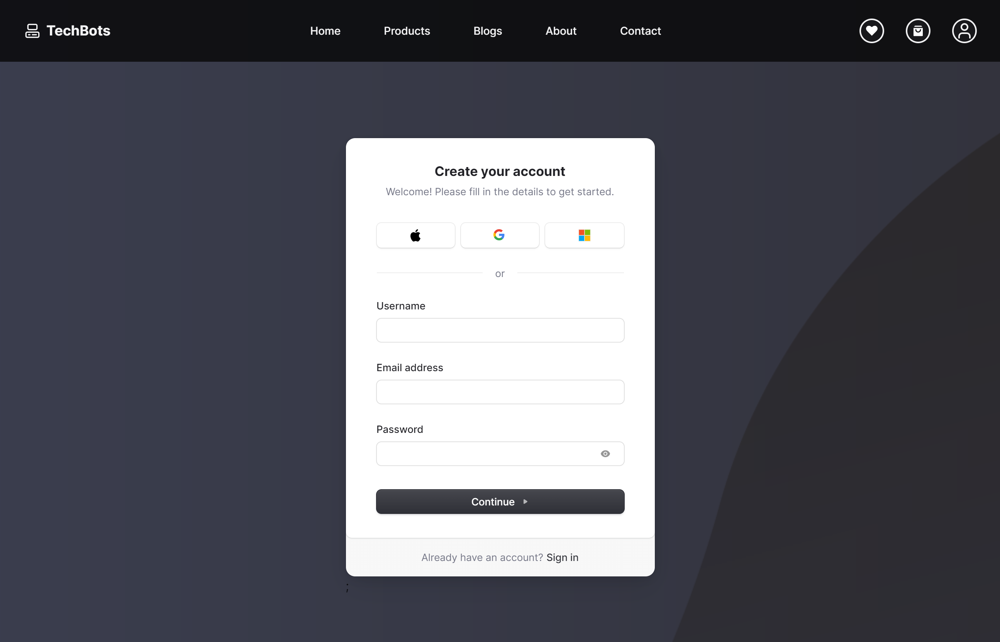
     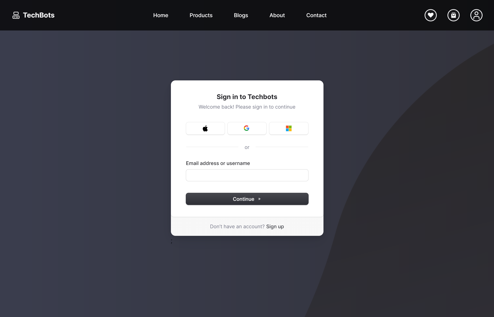
     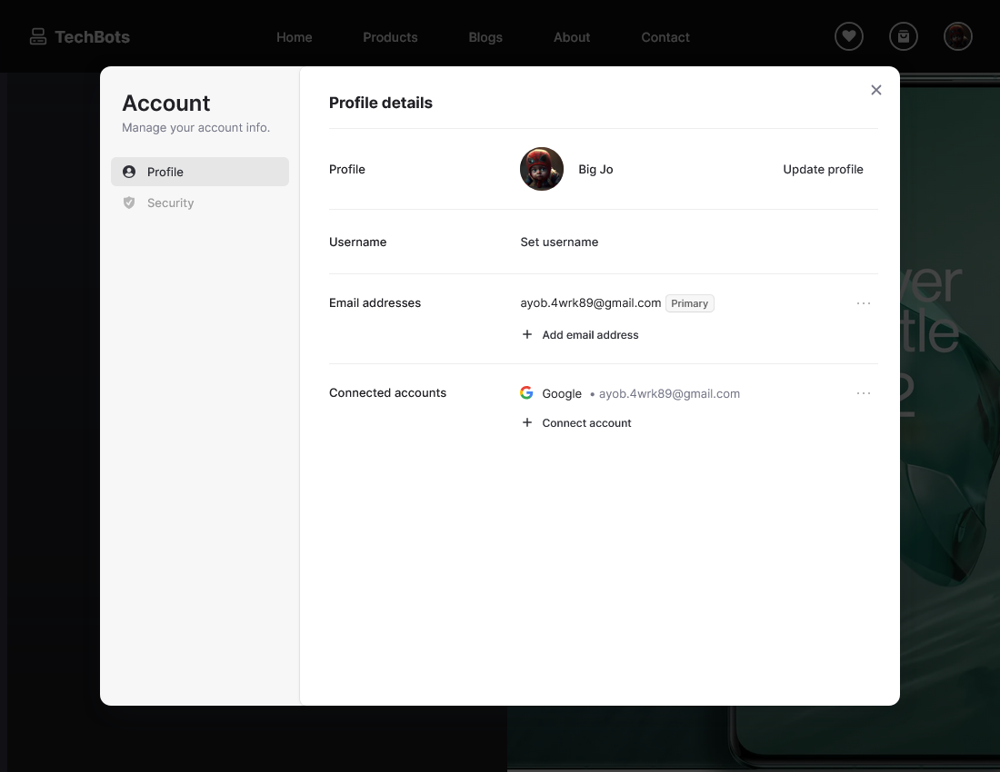

2. **Browse products:**

   - Explore various categories of computer and electronics parts.
     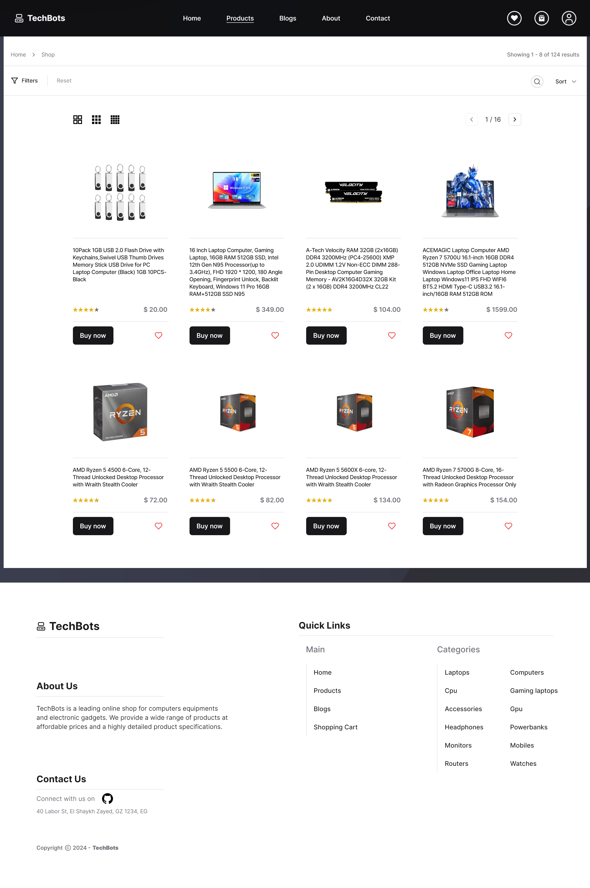
     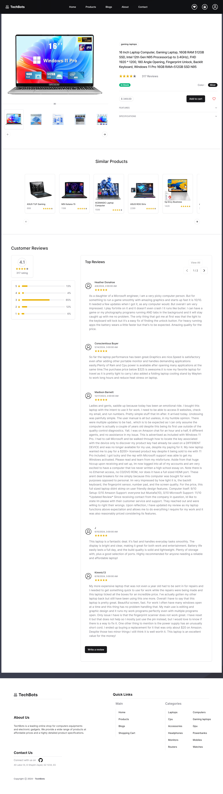

3. **Manage your cart:**

   - Add items to your cart, update quantities, and remove items as needed.
     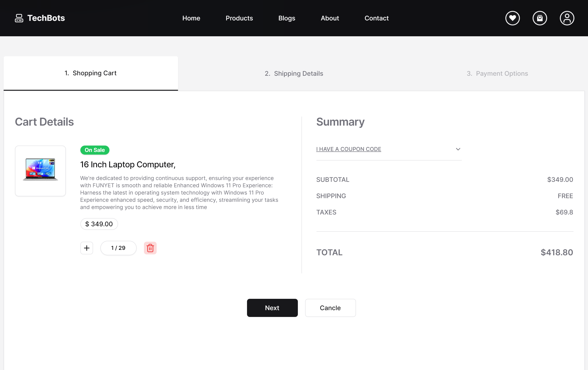
     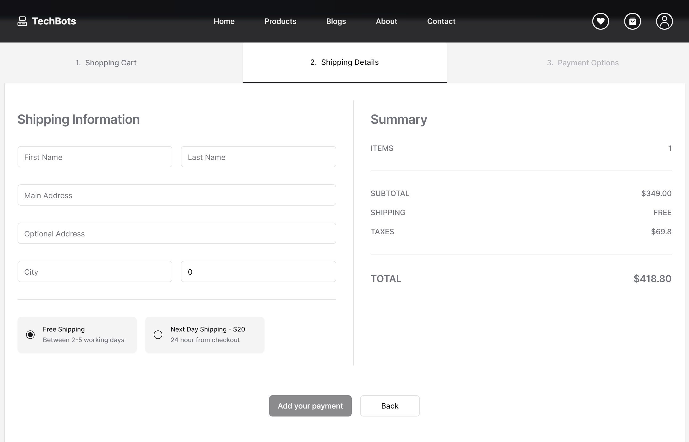
     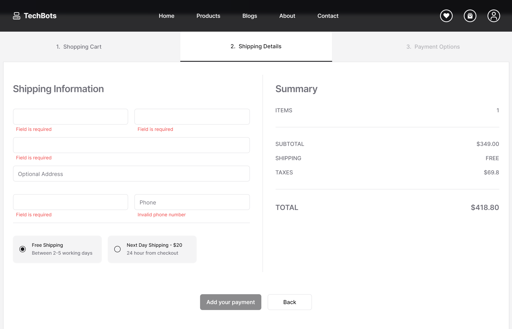
     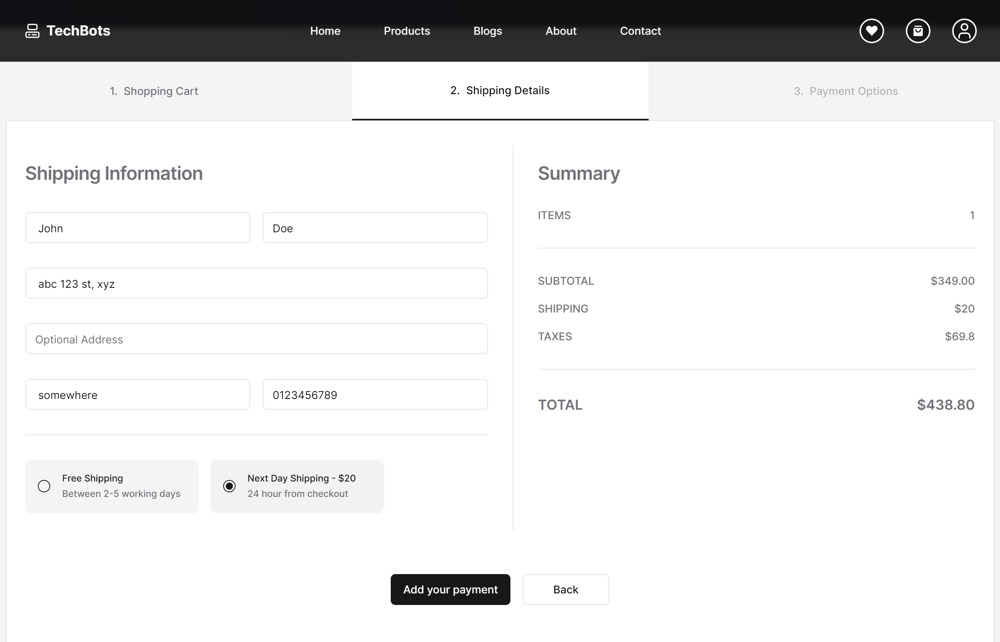

4. **Place an order:**

   - Proceed to checkout, enter your shipping information, and complete the payment process.
     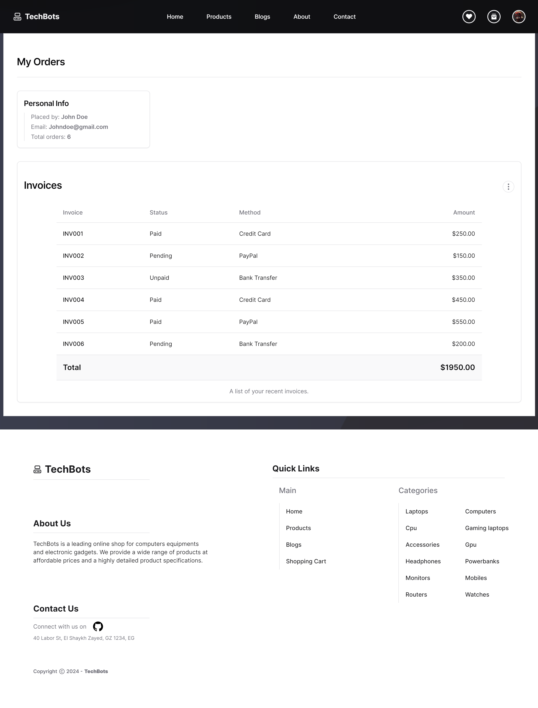
     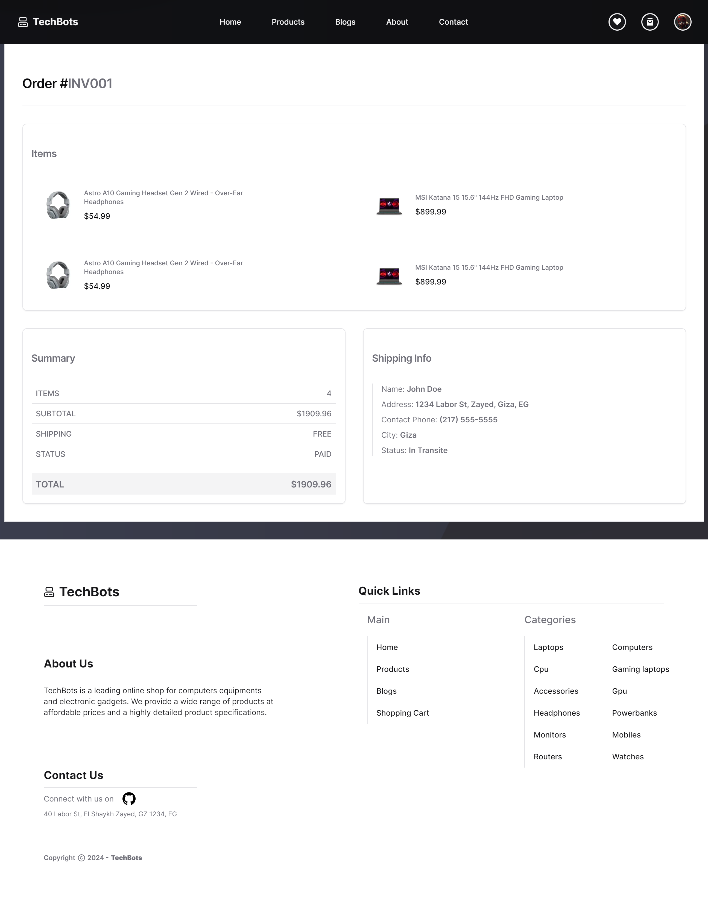

5. **Write reviews:**
   - Share your feedback on purchased products by writing reviews.
     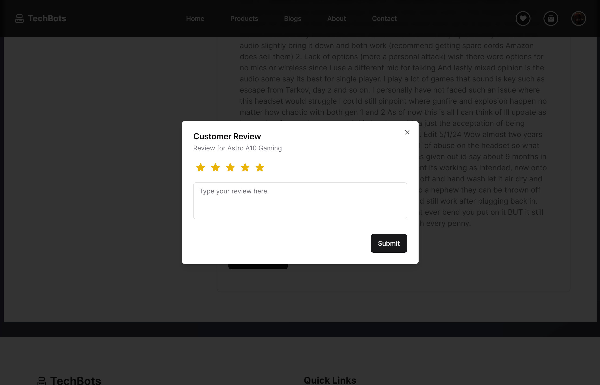

## Contributing

We welcome contributions from the community! To contribute to TechBots:

1. **Fork the repository:**

   - Click on the "Fork" button at the top right corner of the repo page.

2. **Clone your fork:**

   ```sh
   git clone https://github.com/ahmadyousif89/techbots.git
   cd techbots
   ```

3. **Create a new branch:**

   ```sh
   git checkout -b feature/your-feature-name
   ```

4. **Make your changes:**

   - Implement your feature or bug fix.

5. **Commit your changes:**

   ```sh
   git add .
   git commit -m "Add feature/your-feature-name"
   ```

6. **Push to your fork:**

   ```sh
   git push origin feature/your-feature-name
   ```

7. **Create a pull request:**
   - Go to the original repository and click on "New Pull Request."

## Related Projects

Here are some projects related to TechBots:

- **Newegg:** A popular e-commerce platform for computer hardware and consumer electronics.
- **Amazon Electronics:** The electronics section of Amazon, featuring a wide range of products.
- **PCPartPicker:** A platform for building and sharing PC part lists, with price comparisons and compatibility checks.

## Licensing

TechBots is licensed under the MIT License. See the [LICENSE](LICENSE) file for more details.

---

Thank you for using TechBots! For any questions or feedback, please contact us through our [LinkedIn page](https://www.linkedin.com/in/dev-ahmadyousif/).
